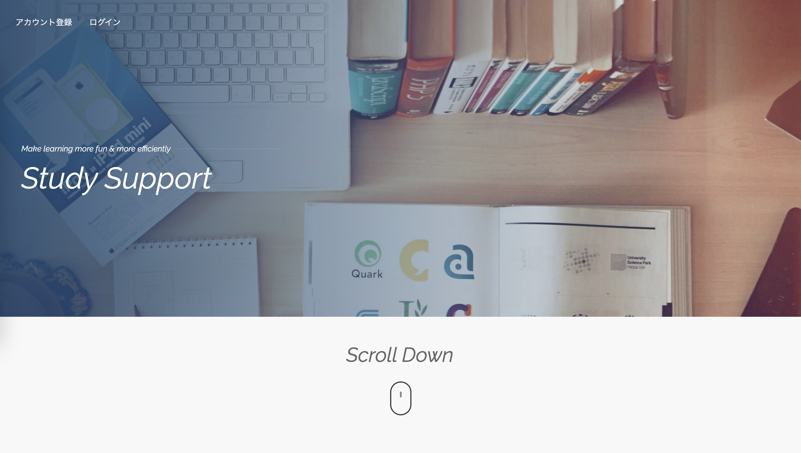
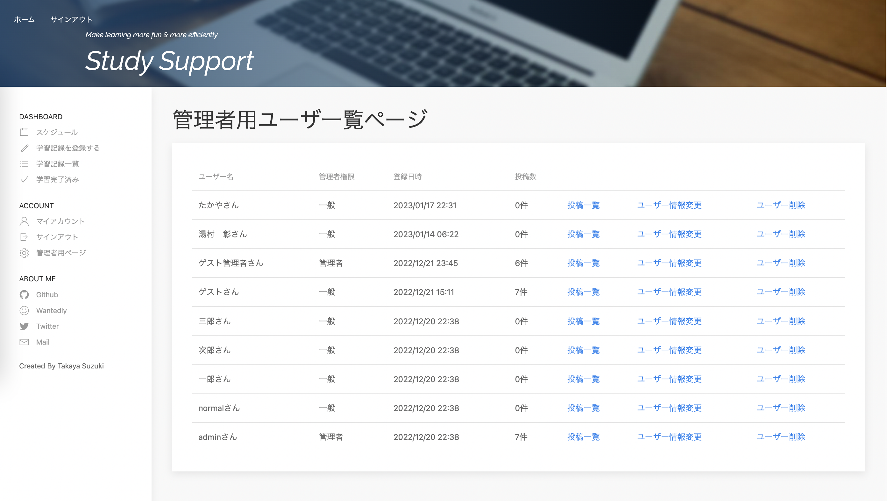
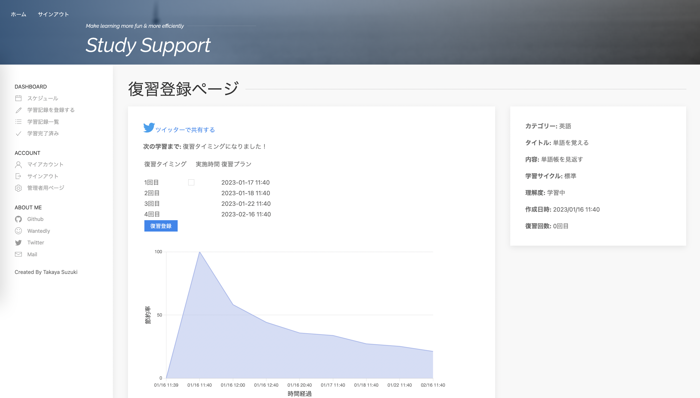
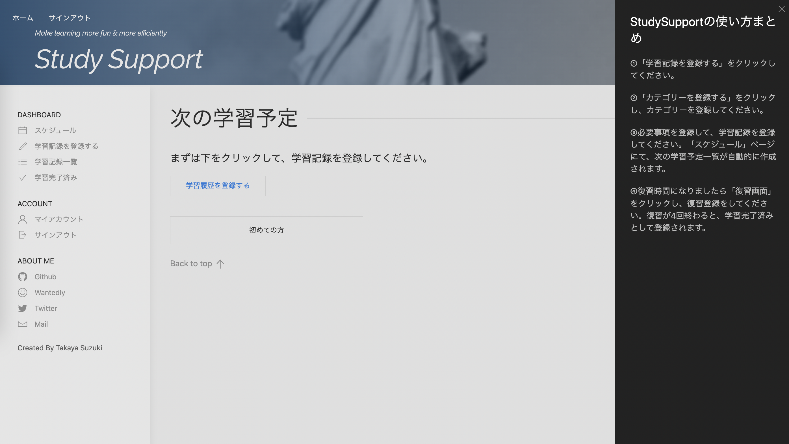
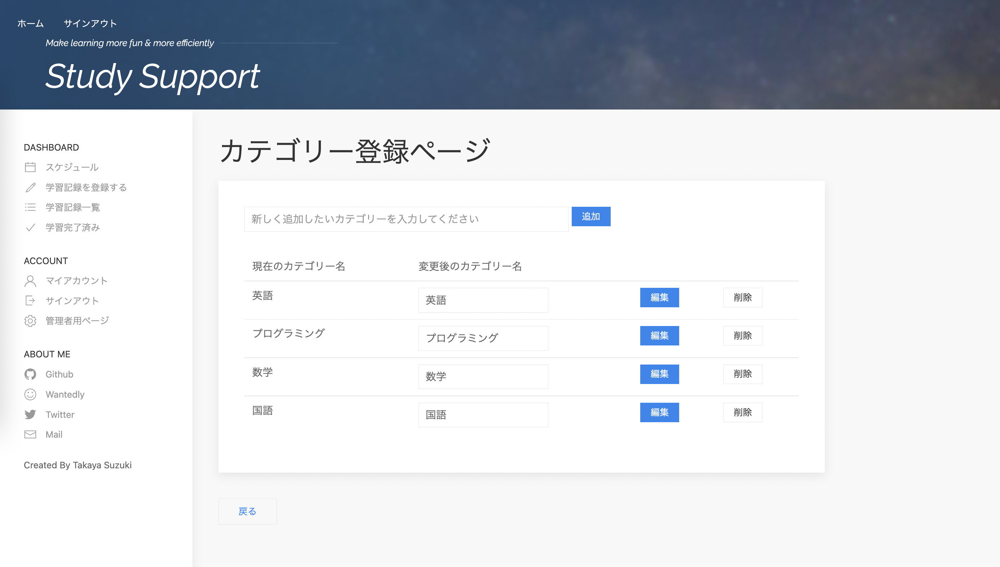
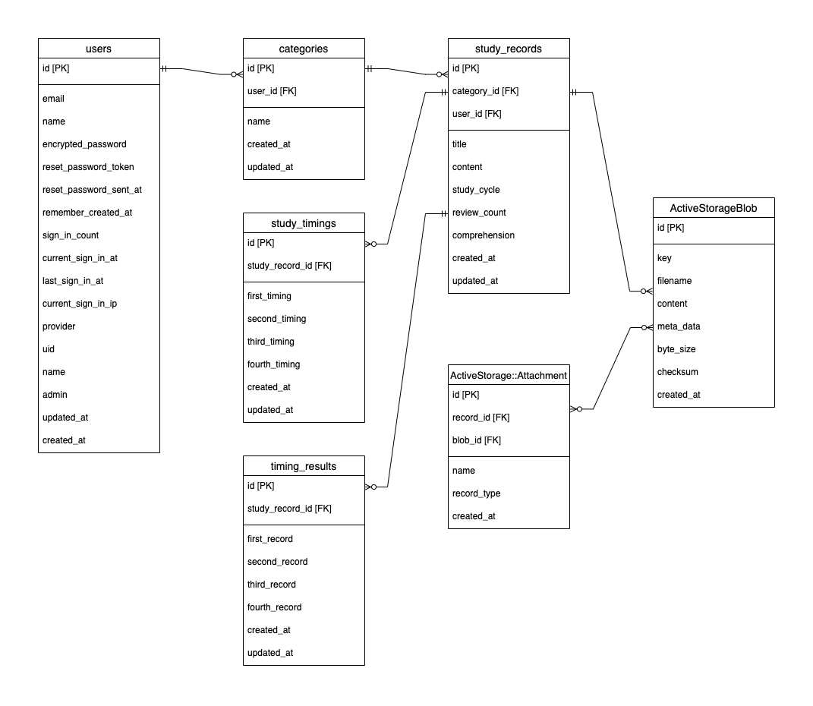
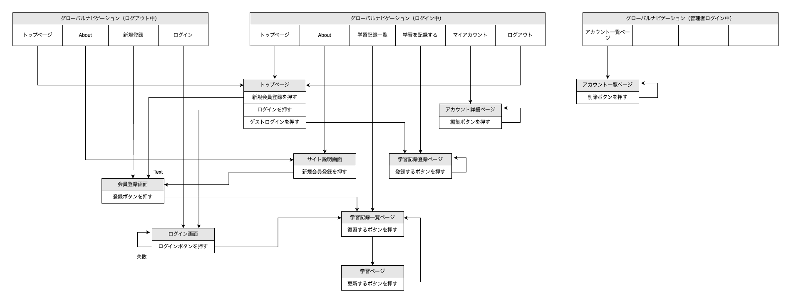

## README
StudySupport  
url: https://study-support-app.jp/  
(初めての方は画面を下にスクロールしてください。ページ下部にてゲストログインが可能です。)
<br>



[](https://github.com/takaya8522/Study_Support_App/tree/main)
[](https://github.com/takaya8522/Study_Support_App/tree/main)
[](https://github.com/takaya8522/Study_Support_App/releases/latest)
[](https://github.com/takaya8522/Study_Support_App/releases/latest)
[](https://github.com/takaya8522/Study_Support_App/stargazers)

[](https://github.com/takaya8522/Study_Support_App/commits)
[](https://github.com/takaya8522/Study_Support_App/issues)
[](https://github.com/takaya8522/Study_Support_App/issues?q=is%3Aissue+is%3Aclosed)
[](https://github.com/takaya8522/Study_Support_App)
[](https://github.com/takaya8522/Study_Support_App)


<br>

## 製品概要 / Overview
プログラミングを勉強してみると覚えることが多すぎて大変！少しでも効率的に勉強をしたい！  
そんなプログラミングスクール同期生の悩みを解決したい！という一心で「StudySupport」を開発しました。  
このアプリはただのタスク管理アプリではありません！
忘却曲線に基き、自分に最も最適なオリジナルのスケジュールを自動で作成することができます。  
また、どれだけ効率的に学習を進めることが出来るかを表す忘却率を、グラフで見ることも出来ます。  

## 開発言語 / Language
- OS: Linux
- Back End: Ruby 3.0.1, Ruby on Rails 6.1.7 ( Puma ), Nginx
- Front End: HTML, CSS, JavaScript(JQuery), UIkit
- Infra: Docker, Docker-Compose, AWS ( EC2, VPC, IAM, RDS, ALB, Route53, S3 )
- DB: PostgreSQL

## 主要Gem / Main Gems
- devise :ログイン機能 / ゲストログイン機能
- ransack :検索機能
- chartkick :グラフ機能
- cancancan :管理者権限
- kaminari :ページネーション 
- rspec / factory_bot_rails :テストフレームワーク
- mini_magick / aws-sdk-s3 :画像アップロード
- rubocop / erb_lint :Lintツール

## インフラ図 / Infrastructure
使用ソフト: draw.io  


## 機能 / Functions
- スケジュール・復習タイミング自動作成 / 残り時間表示機能 (Gem使用無し)

<br>

- 管理者用ページ機能 (Gem使用無し)

<br>

- 忘却率を表すグラフの自動作成機能 (chartkick) / 非同期通信で復習タイミングを登録する機能 (ajax)

<br>

- UI/UX改善 (ダッシュボード実装、使い方表示用のボタン実装など)

<br>

- カテゴリーを登録する際、ページ遷移無しでCRUD機能を実行する機能 (ajax)

<br>

- レスポンシブデザイン対応 (Uikit)

<br>

## ER図 / Entity Relationship Diagram
使用ソフト: draw.io  


## 画面遷移図 / Screen Transition Diagram
使用ソフト: draw.io  


## アプリの使い方 / How to use
1. 「学習記録を登録する」をクリックしてください。
1. 「カテゴリーを登録する」をクリックし、カテゴリーを登録してください。
1. 必要事項を記入して、学習記録を登録してください。  
「スケジュール」ページにて、次の学習予定一覧が自動的に作成されます。
1. 復習時間になりましたら「復習画面」をクリックし、復習登録をしてください。  
復習が4回終わると、学習完了済みとして登録されます。

## 実行手順 / Procedure
```
$ git clone git@github.com:takaya8522/learning_management_app.git
$ cd learning_management_app
$ docker-compose build --no-cache
$ docker-compose up -d
$ docker-compose exec app rails db:create && rails db:migrate
```

## カタログ設計とテーブル定義書 / Catalog Design & Table Definition
使用ソフト: Google Sheets  
https://docs.google.com/spreadsheets/d/18VkBayIlMdg-bML_hHs3Ka77BNrWWdjBx12f_PmN8MM/edit?usp=sharing

## ワイヤーフレーム / Wire frame
使用ソフト: figma  
https://www.figma.com/file/0tbZ7puai7oA7PGhsBlbHV/%E3%83%AF%E3%82%A4%E3%83%A4%E3%83%BC%E3%83%95%E3%83%AC%E3%83%BC%E3%83%A0?node-id=0%3A1

## 今後実装したいもの / My plans
- Github Actionsを使ったCI/CD実装
- デプロイ先をEC2からFargateへ移行
- フレームワークにReactを実装
- 友達登録機能（他のユーザーの投稿を見れるようにする）追加
